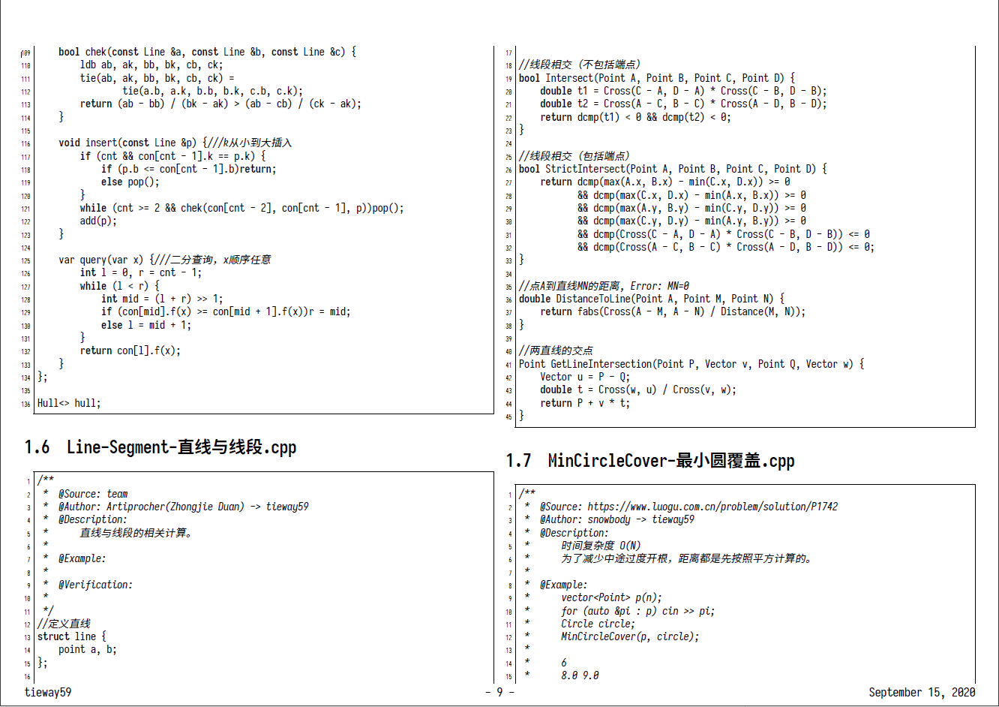
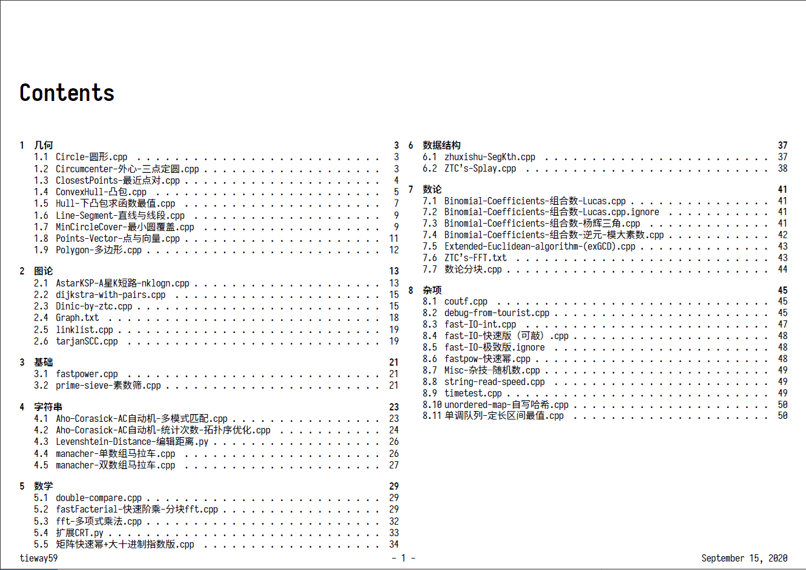
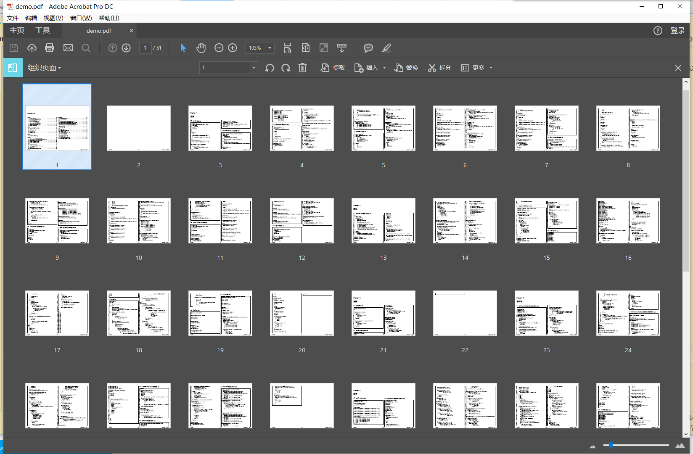

# 代码书生成器（CodeFilesToPDF）

## 背景

参加算法竞赛可以带纸质参考材料，所以每次赛前准备材料的打印是一个很头疼的问题。

当然也不乏许多大佬平时就有良好习惯，自己的模板都已经整理成md文件了。

但是我认为这其中还是有缺陷的：

- 如果单个md文件太长，就不便于修订和整理。（而且容易卡顿）

- 如果md文件较短但是太多，就不便于最后整合pdf打印。

## 一个冒失但可行的方案

我们知道Latex是是很好的编书工具。

Latex的minted包有不错的代码排版效果。

并且支持外部文件通过url导入，这部分代码非常程序化。

那么只要有一个把文件夹结构翻译成tex的语句就好。

在分支中有一个我去年做过的C++的尝试[link](https://github.com/TieWay59/tmplz/tree/v0.1.0-archived)

今年我想用python做一遍，并且在样式上有更多改进创新。

## 环境

- win10（2019中旬之后的版本）

- python 3.7.2 (必须)

- OneLeaf （在线latex编译平台，当然你能本地编译LuaLatex也很好）

## 使用

1. 把模板文件夹放入`codefiles`路径下。
2. 运行main.py
3. `latexbuild`中的文件编译。（建议上传OneLeaf，在线Lua编译）

## 优点

- win10 (?)
- 方便修订和改目录
- 减少排版和复制粘贴
- 文件目录即是内容目录
- 支持关联部分扩展名的代码程序，main.cpp
- python真香

## 缺陷

- 标题只能分到LaTeX book类的四级。
    - 这个本身问题不大，但chapter标题会导致分页，还没有消除。
- ~~如果代码文件保存时的编码和当前系统编码不同，中文会乱码。(已改良)~~
- 一些长压行的代码会折行异常。（点名批评压行选手）

## 待办

- [ ] 优化chapter标题导致的过度分页
- [ ] 增加引入md的feature 
